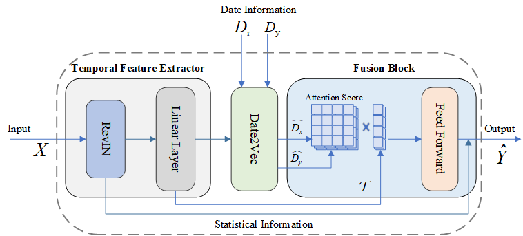
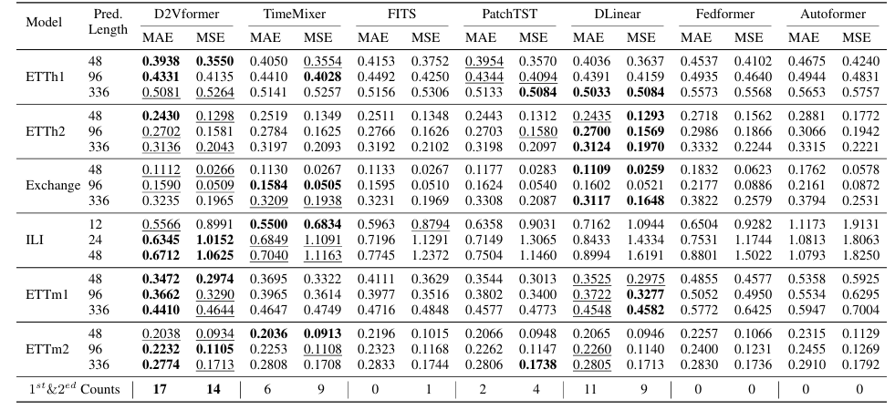

# D2Vformer 

## Introduction

This is the pytorch implementation of D2Vformer. 

The architecture of our model(D2Vformer) is shown as below:


Through extensive experiments on six datasets, we demonstrate that D2Vformer outperforms previous state-of-the-art methods respectively for  multivariate forecasting tasks and skip prediction tasks

## Setup

### 1. Create conda environment(Optional)
```
conda create -n dateformer -y python=3.8 
conda activate dateformer
```

### 2. Install dependecies
Install the required packages
```
pip install -r requirements.txt
```


### 3. Download the data
We follow the same setting as previous work. The datasets for all the six benchmarks can be obtained from [[Autoformer](https://github.com/thuml/Autoformer)]. The datasets are placed in the 'all_six_datasets' folder of our project. The tree structure of the files are as follows:

```
Dateformer\datasets
├─electricity
│
├─ETT-small
│
├─exchange_rate
│
├─illness
│
└─traffic
```

### 4. Experimental setup
The length of the historical input sequence is maintained at $96$(or $36$ for the illness dataset), whereas the length of the sequence to be predicted is selected from a range of values, i.e., $\{48, 96, 336\}$ ($\{24, 36, 48\}$ for the illness dataset). Note that the input length is fixed to be 96 for all methods for a fair comparison. The evaluation is based on the mean squared error (MSE) and mean absolute error (MAE) metrics

## Comparison


## Contact

If there are any issues, please ask in the GitHub Issue module.
