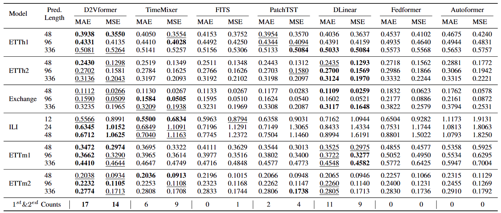
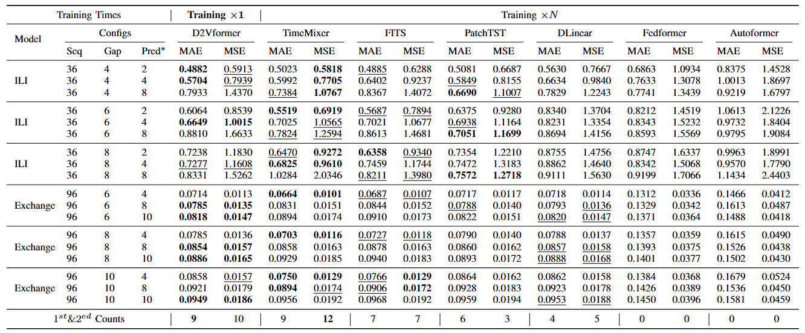
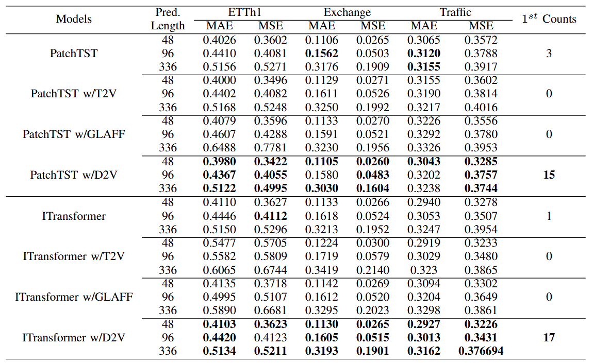

# D2Vformer 

A official pytorch implementation for the paper: ' *D2Vformer: A Flexible Time Series Prediction Model Based on Time Position Embedding* ' 

## 🎯Introduction

This is the pytorch implementation of D2Vformer. 
Unlike conventional prediction methods that rely on fixed-length predictors, D2Vformer can directly handle scenarios with arbitrary prediction lengths.
Additionally, it significantly reduces training resource consumption and proves highly effective in real-world dynamic environments.
The architecture of our model(D2Vformer) is shown as below:


Through extensive experiments on six datasets, we demonstrate that D2Vformer outperforms previous state-of-the-art methods respectively for  multivariate forecasting tasks and skip prediction tasks

## 📚Model Statics 
The following are the baseline models included in this project (continuously updated):

- Autoformer [PDF](http://proceedings.neurips.cc/paper/2021/file/bcc0d400288793e8bdcd7c19a8ac0c2b-Paper.pdf) [Code](https://github.com/thuml/autoformer)  (NlPS 2021)
- Dlinear [PDF](https://arxiv.org/abs/2205.13504)  (AAAl 2022)
- Fedformer [PDF](https://arxiv.org/pdf/2201.12740v3.pdf) [Code](https://github.com/MAZiqing/FEDformer)  (lCML 2022)
- PatchTST [PDF](https://arxiv.org/pdf/2211.14730v2.pdf) [Code](https://github.com/yuqinie98/patchtst)  (ICLR 2023)
- FITS [PDF](https://arxiv.org/pdf/2307.03756) [Code](https://github.com/VEWOXIC/FITS) (ICLR 2024)
- TimeMixer [PDF](https://arxiv.org/pdf/2405.14616) [Code](https://github.com/kwuking/TimeMixer) (ICLR 2024)
- ......

## Setup

### Table of Contents:

- <a href='#Install dependecies'>1. Install dependecies </a>
- <a href='#Download the data'>2. Download the data</a>
- <a href='#Experimental setup'>3. Experimental setup</a>


### 📝1. Install dependecies
Install the required packages
```
pip install -r requirements.txt
```


<span id='Download the data'/>

### 👉2. Download the data
We follow the same setting as previous work. The datasets for all the six benchmarks can be obtained from [[Autoformer](https://github.com/thuml/Autoformer)]. The datasets are placed in the 'datasets' folder of our project. The tree structure of the files are as follows:

```
datasets
   ├─electricity
   │
   ├─ETT-small
   │
   ├─exchange_rate
   │
   ├─illness
   │
   └─traffic
```

<span id='Experimental setup'/>

### 🚀3. Experimental setup
The experiment consists of three parts, namely "D2VFormer" for regular time series prediction, "Flexible_Prediction" for jump prediction, and "DateVec" for validating the effectiveness of D2V. We have provided all the experimental scripts for the benchmark in the corresponding section of the `./scripts` folder, which covers all the benchmarking experiments. To reproduce the results, you can run the following shell code.

Run "D2Vformer" experiments
```bash
 ./D2Vformer/scripts/D2Vformer_s_train.sh
 ./D2Vformer/scripts/D2Vformer_train.sh
```

Run "Flexible_Prediction" experiments
```bash
 ./Flexib_Prediction/scripts/D2Vformer.sh
```

Run "DateVec" experiments
```bash
 ./Date2Vec/scripts/PatchTST_train.sh
 ./Date2Vec/scripts/T2V_PatchTST_train.sh
 ./Date2Vec/scripts/GLAFF_PatchTST_train.sh
 ./Date2Vec/scripts/D2V_PatchTST_train.sh
 ...
```

When you run the D2Vformer, the length of the historical input sequence is maintained at $96$(or $36$ for the illness dataset), whereas the length of the sequence to be predicted is selected from a range of values, i.e., $\{48, 96, 336\}$ ($\{24, 36, 48\}$ for the illness dataset). 

When you run the 'Flexible_Prediction', the length of the historical input sequence is maintained at $96$(or $36$ for the illness dataset), whereas the length of the interva is selected from a range of values, i.e., $\{6, 8, 10\}$ ($\{4, 6, 8\}$ for the illness dataset) and the length of the sequence to be predicted is selected from a range of values, i.e., $\{4, 8, 10\}$ ($\{2, 4, 8\}$ for the illness dataset). 

When you run the 'DateVec', we replace the position embedding method to investigate the effectiveness of D2V.

Note that the input length is fixed to be 96 for all methods for a fair comparison. The evaluation is based on the mean squared error (MSE) and mean absolute error (MAE) metrics

## Time Series Forecasting
The results of regular time series forecasting


The results of flexible prediction.


The evaluation of the performance of different timestamp embedding methods

